# Heirloom Gallery - Developer Documentation

## System Overview

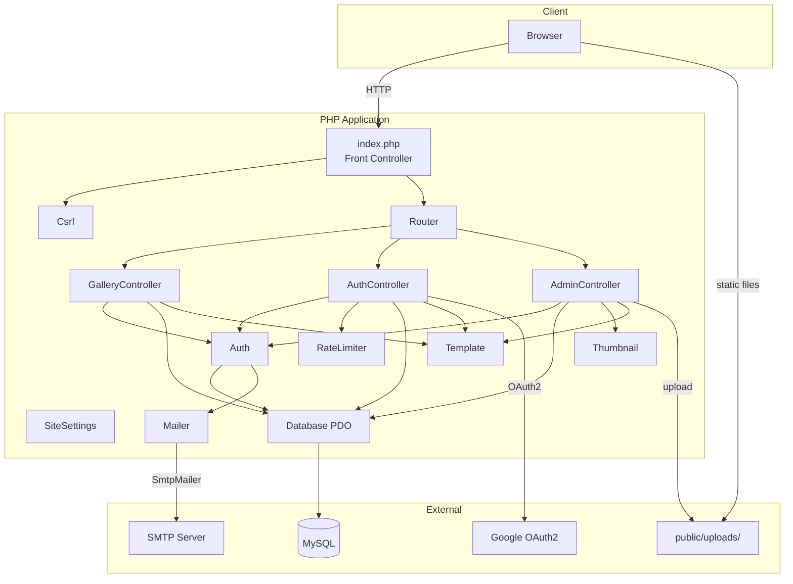

## Request Lifecycle

Every request flows through a single entry point with CSRF protection and session management.

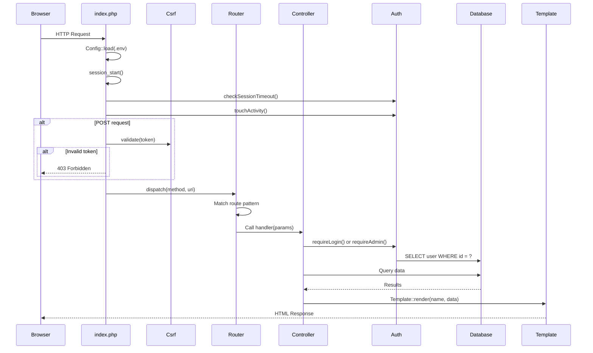

## Authentication Flow

The application supports three authentication methods that converge on a single user record matched by email. Registration is via magic link only. Google OAuth is for returning users.

### Magic Link Registration and Login

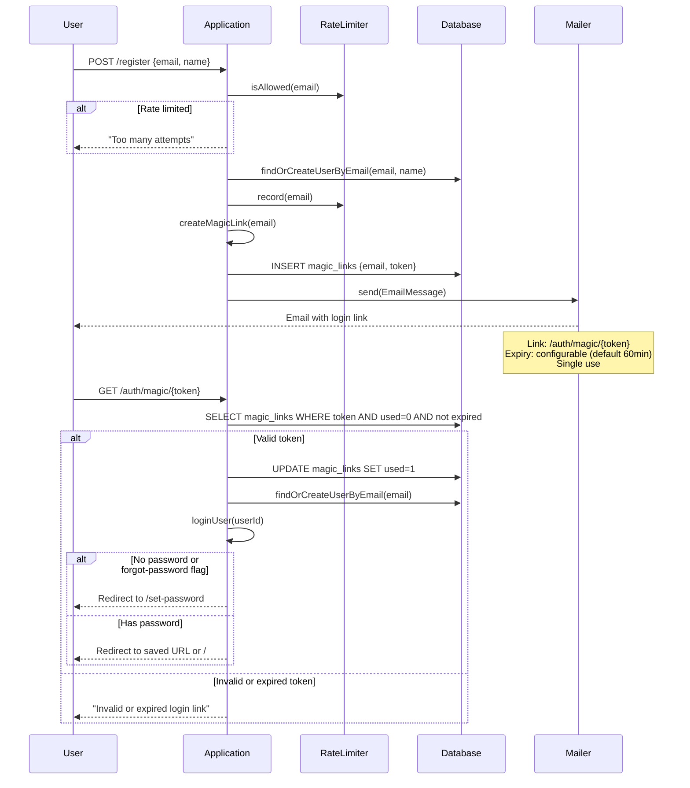

### Password Login

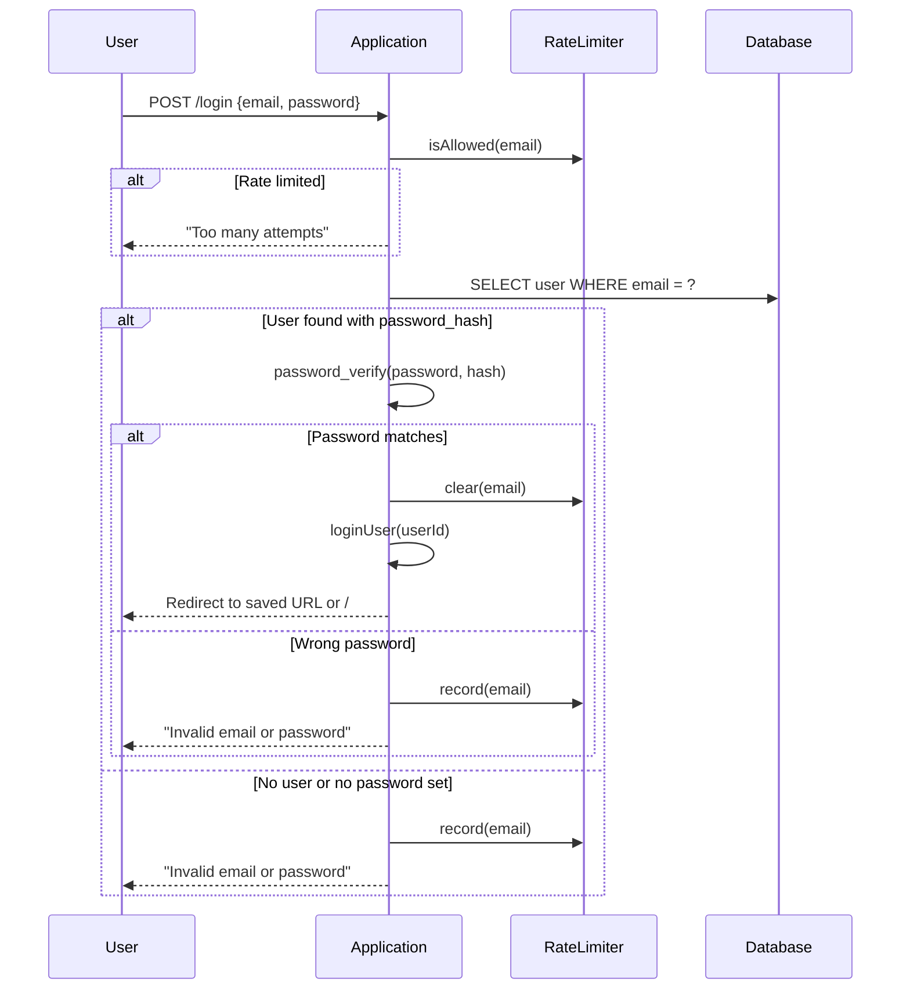

### Google OAuth2 Login (existing users only)

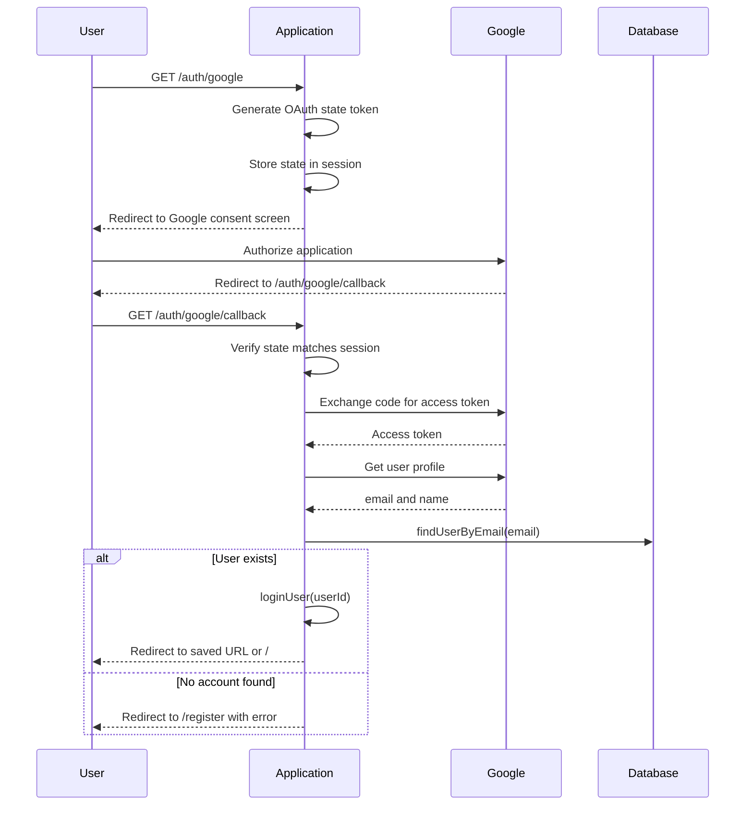

### Magic Link Token Lifecycle

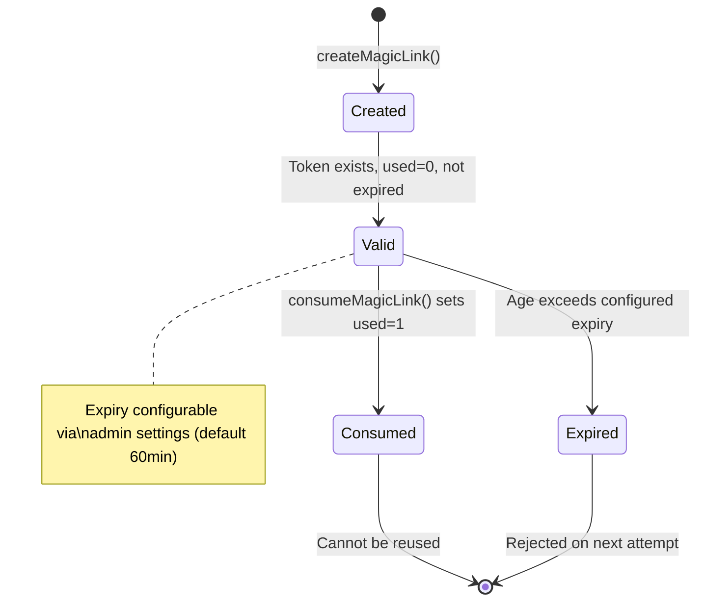

## Award and Notification Flow

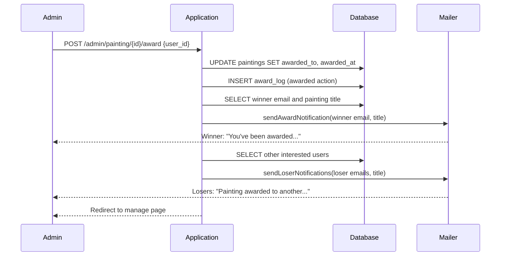

## Painting Lifecycle

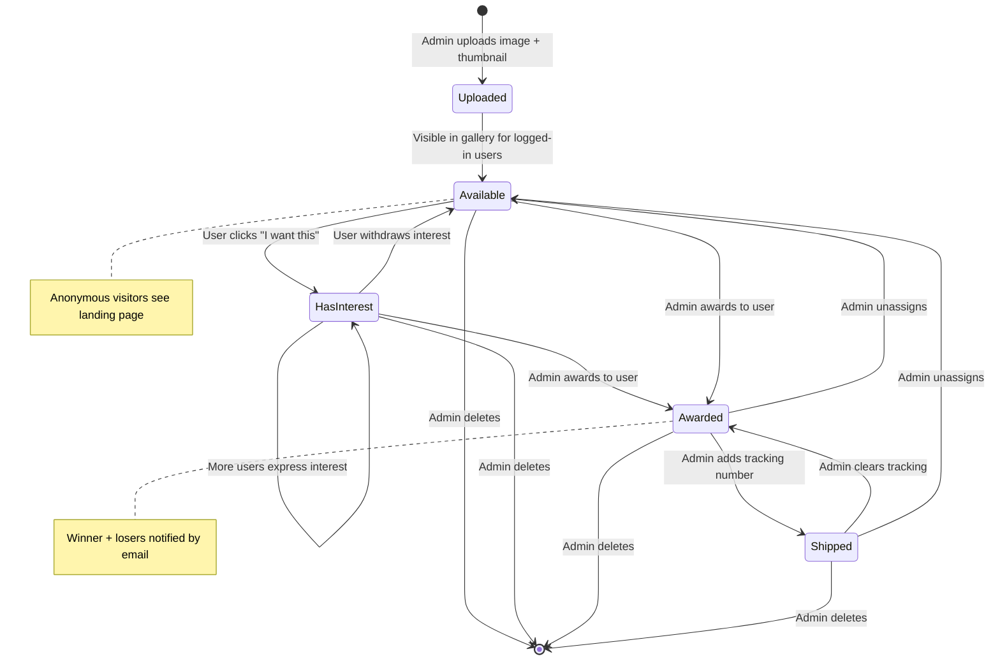

## Database Schema

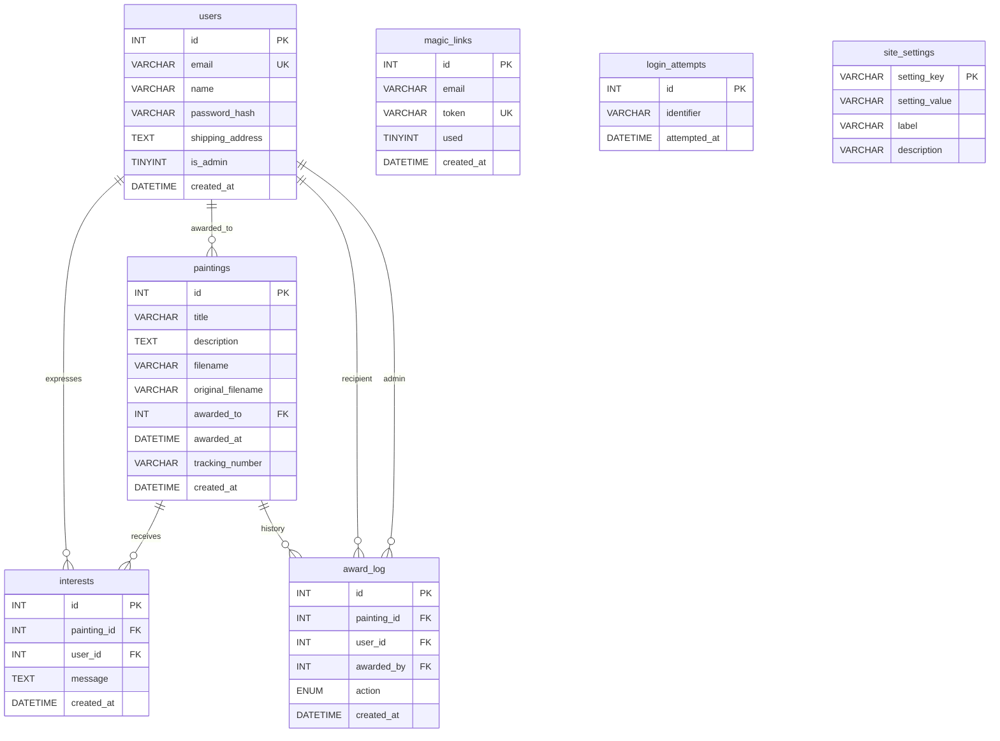

## Route Map

### Gallery Routes (GalleryController)

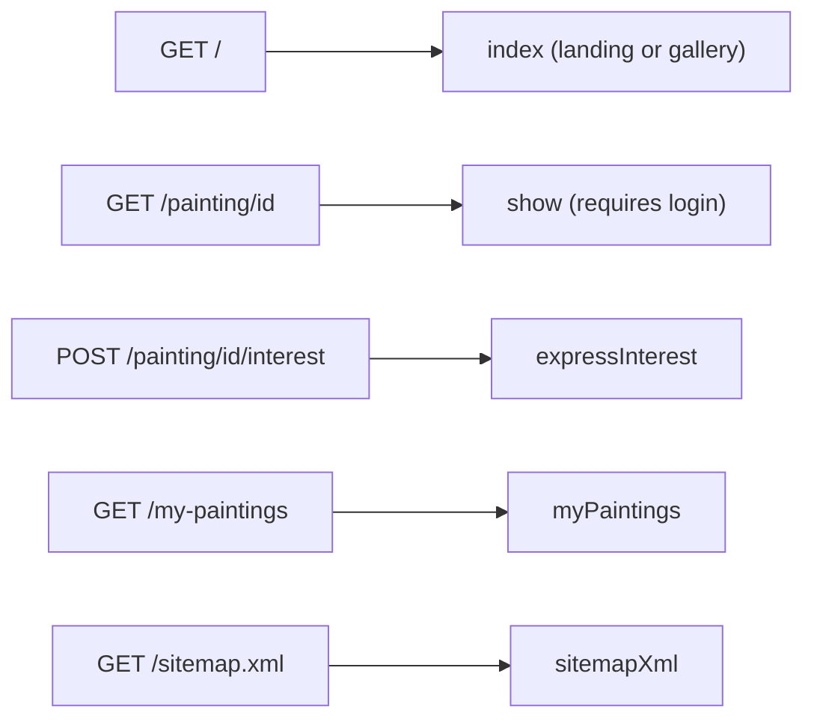

### Auth Routes (AuthController)

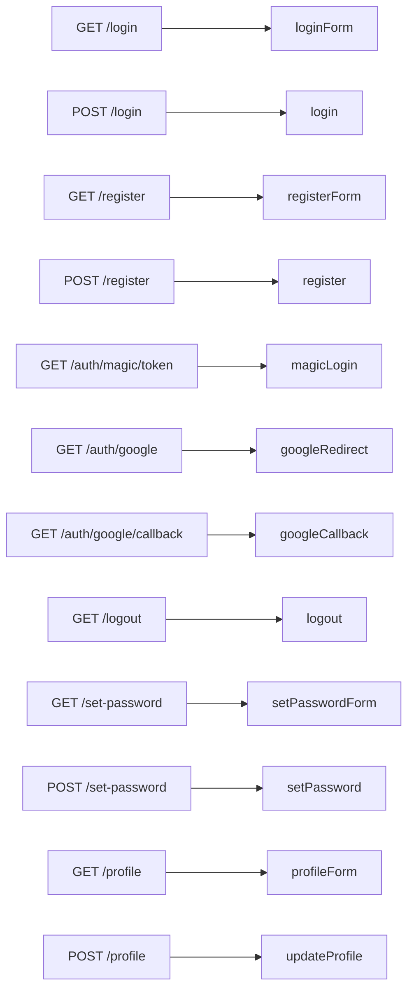

### Admin Routes (AdminController)

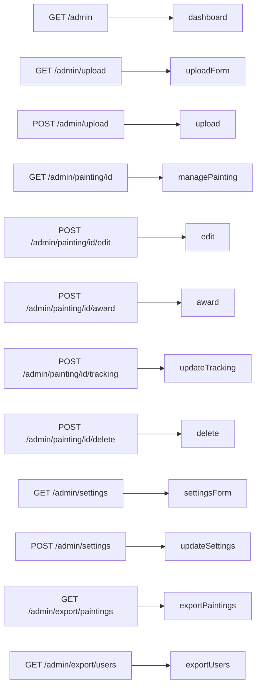

## Class Diagram

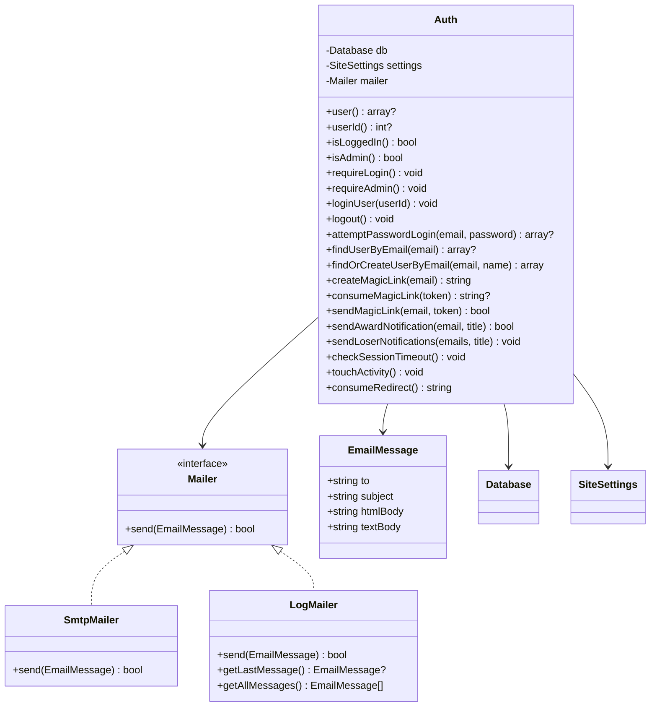

## Project Structure

```
heirloom/
├── public/                     Web root (server document root)
│   ├── index.php               Front controller with CSRF, session timeout
│   ├── .htaccess               Apache rewrite + cache headers
│   ├── .user.ini               PHP upload/memory limits (production)
│   ├── robots.txt              Search engine directives
│   ├── css/style.css           Stylesheet (cache-busted via ?v=)
│   └── uploads/                Uploaded images + thumbnails
├── src/                        Application code (PSR-4: Heirloom\)
│   ├── Auth.php                Authentication, sessions, email notifications
│   ├── Config.php              .env file parser
│   ├── Csrf.php                CSRF token generation and validation
│   ├── Database.php            PDO wrapper (MySQL, injectable for tests)
│   ├── EmailMessage.php        Email value object (to, subject, body)
│   ├── LogMailer.php           Dev mailer — logs to error_log
│   ├── Mailer.php              Mailer interface
│   ├── RateLimiter.php         Login/register attempt throttling
│   ├── Router.php              Regex-based URL router
│   ├── SiteSettings.php        Database-backed key/value settings
│   ├── SmtpMailer.php          Production mailer via PHPMailer
│   ├── Template.php            View renderer with globals and XSS escaping
│   ├── Thumbnail.php           GD-based image thumbnail generation
│   └── Controllers/
│       ├── AdminController     Dashboard, upload, edit, award, export, settings
│       ├── AuthController      Login, register, OAuth, profile, password
│       └── GalleryController   Gallery, painting detail, interest, my-paintings
├── templates/                  PHP view templates
│   ├── layout.php              Base HTML with nav, OG tags, footer
│   ├── landing.php             Anonymous landing page
│   ├── gallery.php             Painting grid with search/sort
│   ├── painting.php            Single painting detail
│   ├── my-paintings.php        User's wanted/awarded/lost paintings
│   ├── profile.php             User profile with shipping address
│   ├── login.php               Login form (password + magic link + Google)
│   ├── register.php            Registration form (magic link only)
│   ├── set-password.php        Optional password setup
│   ├── error.php               Styled error page (404, 403, 500)
│   ├── partials/alerts.php     Reusable error/success flash alerts
│   └── admin/
│       ├── dashboard.php       Stats bar, sortable table, filters, export
│       ├── upload.php           Batch image upload form
│       ├── manage.php           Edit, award, tracking, history, delete
│       └── settings.php         Grouped site settings form
├── tests/                      PHPUnit test suite (~250 tests)
├── spec/                       PHPSpec behavioral specs (29 examples)
├── doc/                        Documentation and ADRs
│   ├── adr/                    Architecture Decision Records (0001-0011)
│   ├── DEVELOPER.md            This file
│   └── USER_GUIDE.md           End user and admin guide
├── .github/
│   ├── workflows/tests.yml     CI: PHPUnit + PHPSpec on every PR
│   ├── workflows/pr-review.yml Automated Claude PR review
│   └── CODEOWNERS              @robsartin owns all files
├── migrate.php                 Schema creation + seed data
├── seed-test-users.php         Sample users with interest messages
├── php-dev.ini                 PHP config for local dev
├── phpunit.xml                 PHPUnit configuration
├── phpspec.yml                 PHPSpec configuration
├── composer.json               Dependencies and scripts
└── .env.example                Environment variable template
```

## Development Workflow

All new code follows **strict TDD** (ADR 0010):

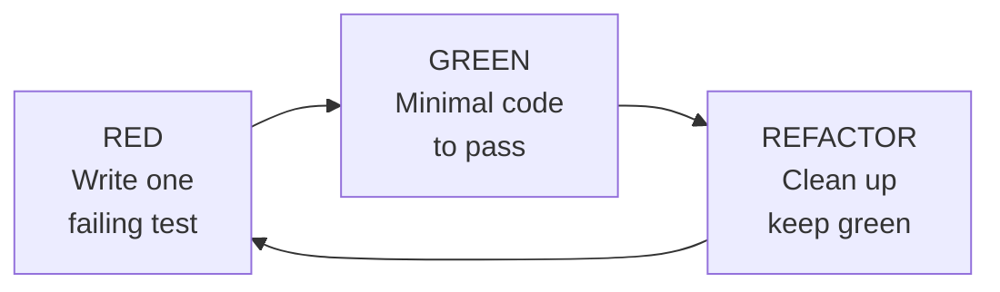

1. Create a feature branch: `git checkout -b feature/my-change`
2. Write one failing test
3. Write minimum code to make it pass
4. Refactor while keeping tests green
5. Repeat until the feature is complete
6. Push and open a PR to `main`
7. CI must pass (PHPUnit + PHPSpec)
8. Merge

### Running tests

```bash
composer test          # PHPUnit
composer spec          # PHPSpec
composer check         # Both
```

### Running locally

```bash
composer install
cp .env.example .env   # Edit with your MySQL credentials
php migrate.php        # Create schema and seed admin
php seed-test-users.php  # Optional: add sample data
php -c php-dev.ini -S localhost:8080 -t public/
```

## Key Design Decisions

| ADR | Decision |
|-----|----------|
| 0002 | PHP 8, no framework |
| 0004 | Server-side offset/limit pagination |
| 0005 | Three auth methods: magic link, password, Google OAuth2 |
| 0006 | CSS-only image resizing, originals stored as-is |
| 0009 | MySQL via PDO (supersedes SQLite) |
| 0010 | Strict TDD for all new code |
| 0011 | Branch-based development, PR to main, must pass tests |

Full ADRs are in `doc/adr/`.
