# Heirloom Gallery - Developer Documentation

## System Overview

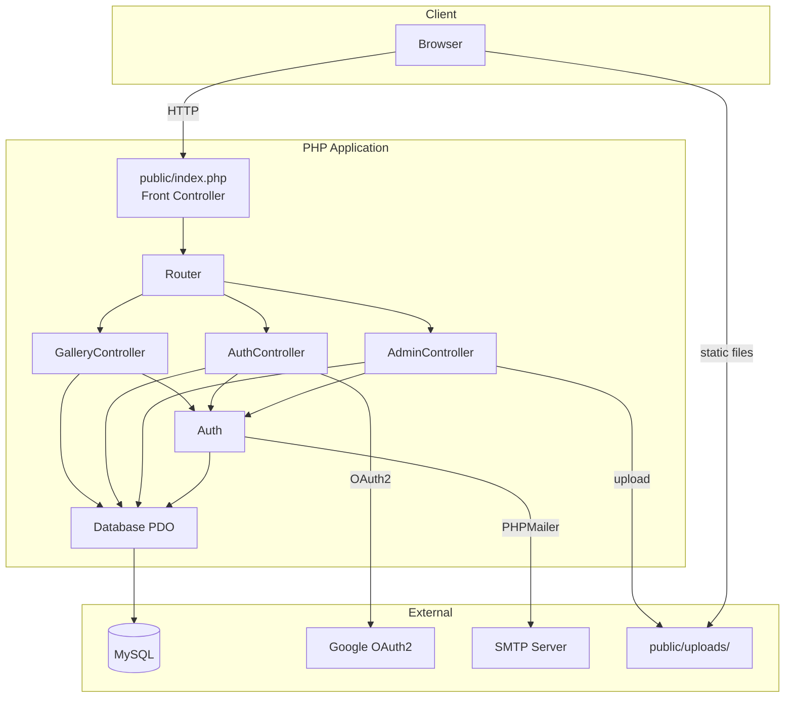

## Request Lifecycle

Every request flows through a single entry point. This diagram shows the complete path from browser to response.

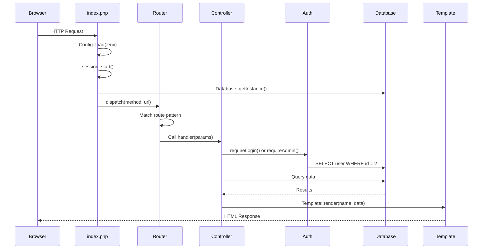

## Authentication Flow

The application supports three authentication methods that converge on a single user record matched by email.

### Magic Link Registration and Login

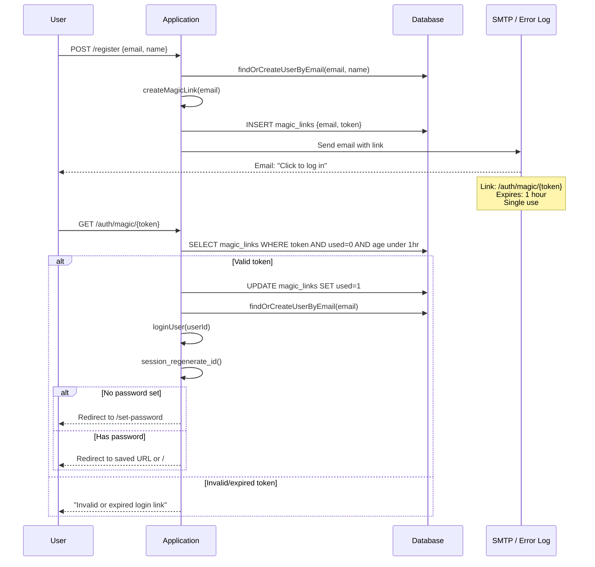

### Password Login

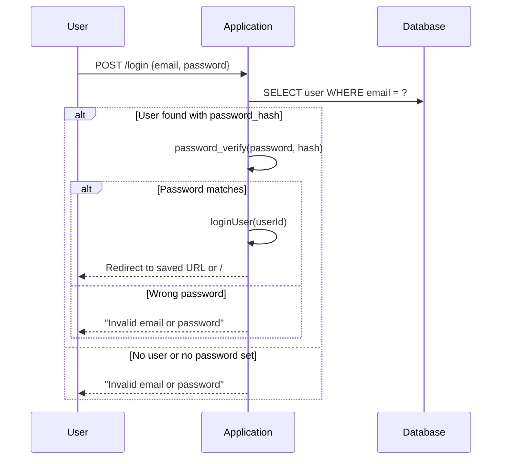

### Google OAuth2 Login

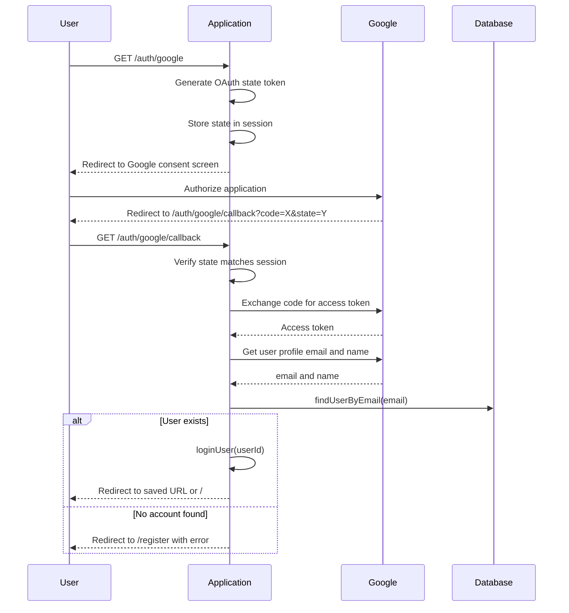

### Magic Link Token Lifecycle

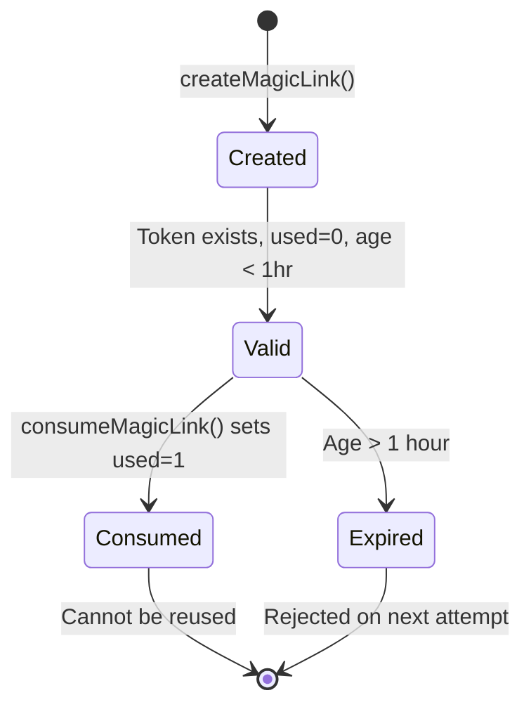

## Painting Lifecycle

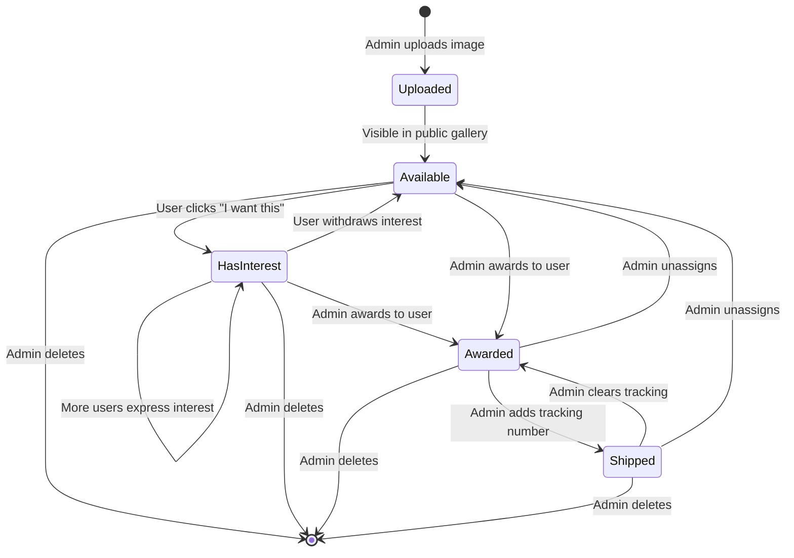

## Database Schema

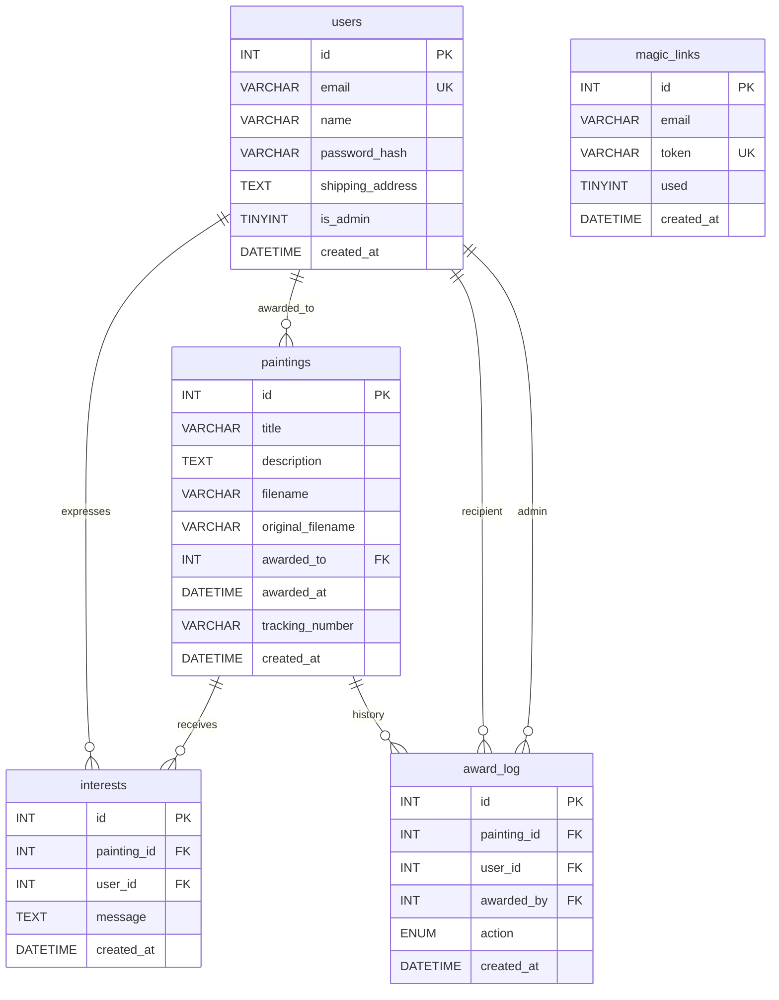

## Route Map

### Gallery Routes (GalleryController)

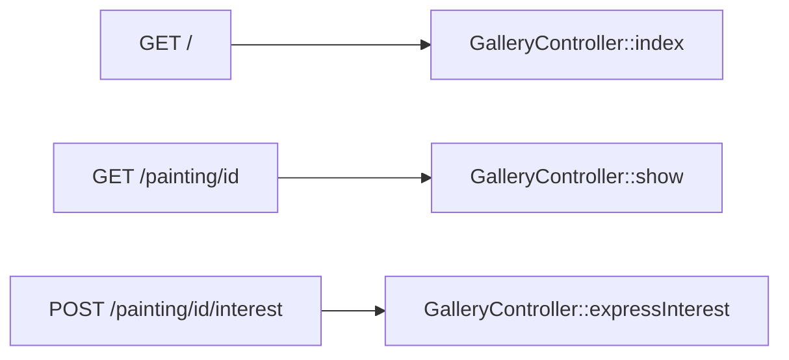

### Auth Routes (AuthController)

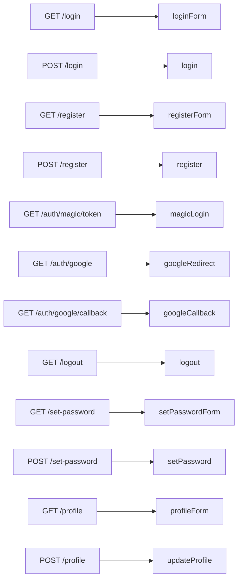

### Admin Routes (AdminController)

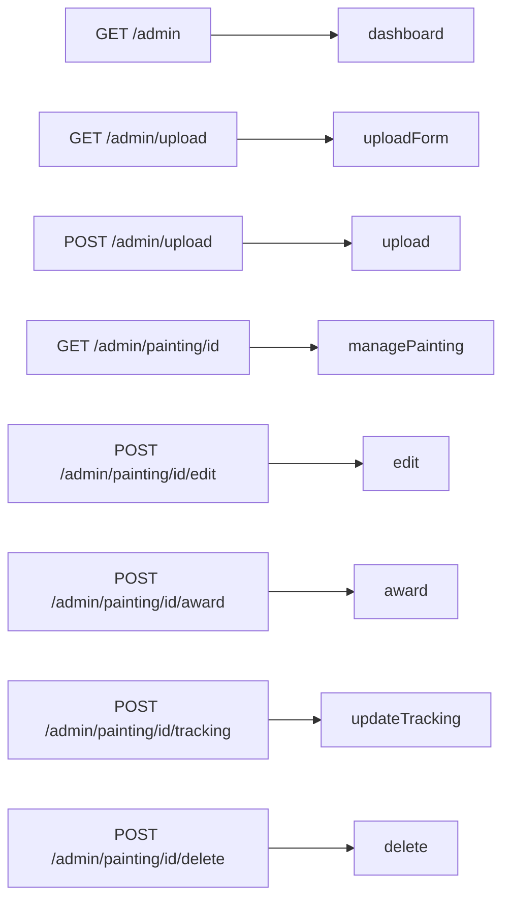

## Project Structure

```
heirloom/
├── public/                     Web root (server document root)
│   ├── index.php               Front controller - all requests enter here
│   ├── .htaccess               Apache rewrite rules
│   ├── .user.ini               PHP upload/memory limits (production)
│   ├── css/style.css           Stylesheet
│   └── uploads/                Uploaded painting images
├── src/                        Application code (PSR-4: Heirloom\)
│   ├── Config.php              .env file parser
│   ├── Database.php            PDO wrapper (MySQL, injectable for tests)
│   ├── Router.php              Regex-based URL router
│   ├── Auth.php                Session management, login, magic links, OAuth
│   ├── Template.php            View renderer with XSS escaping
│   └── Controllers/
│       ├── GalleryController   Public gallery, painting detail, interest toggle
│       ├── AuthController      Login, register, magic link, Google OAuth, profile
│       └── AdminController     Dashboard, upload, edit, award, tracking, delete
├── templates/                  PHP view templates
├── tests/                      PHPUnit test suite
├── spec/                       PHPSpec behavioral specifications
├── doc/                        Documentation and ADRs
│   └── adr/                    Architecture Decision Records (0001-0011)
├── .github/
│   ├── workflows/tests.yml     CI: PHPUnit + PHPSpec on every PR
│   ├── workflows/pr-review.yml Automated Claude PR review for external PRs
│   └── CODEOWNERS              @robsartin owns all files
├── migrate.php                 Database schema creation + admin/test user seed
├── seed-test-users.php         Sample users with humorous interest messages
├── php-dev.ini                 PHP config for local dev (large upload limits)
├── phpunit.xml                 PHPUnit configuration
├── phpspec.yml                 PHPSpec configuration
├── composer.json               Dependencies and scripts
└── .env.example                Environment variable template
```

## Development Workflow

All new code follows **strict TDD** (ADR 0010):

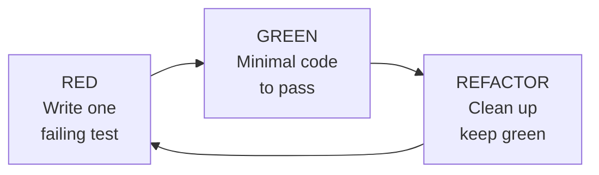

1. Create a feature branch: `git checkout -b feature/my-change`
2. Write one failing test
3. Write minimum code to make it pass
4. Refactor while keeping tests green
5. Repeat until the feature is complete
6. Push and open a PR to `main`
7. CI must pass (PHPUnit + PHPSpec)
8. Merge

### Running tests

```bash
composer test          # PHPUnit
composer spec          # PHPSpec
composer check         # Both
```

### Running locally

```bash
composer install
cp .env.example .env   # Edit with your MySQL credentials
php migrate.php        # Create schema and seed admin
php seed-test-users.php  # Optional: add sample data
php -c php-dev.ini -S localhost:8080 -t public/
```

## Key Design Decisions

| ADR | Decision |
|-----|----------|
| 0002 | PHP 8, no framework |
| 0004 | Server-side offset/limit pagination |
| 0005 | Three auth methods: magic link, password, Google OAuth2 |
| 0006 | CSS-only image resizing, originals stored as-is |
| 0009 | MySQL via PDO (supersedes SQLite) |
| 0010 | Strict TDD for all new code |
| 0011 | Branch-based development, PR to main, must pass tests |

Full ADRs are in `doc/adr/`.
